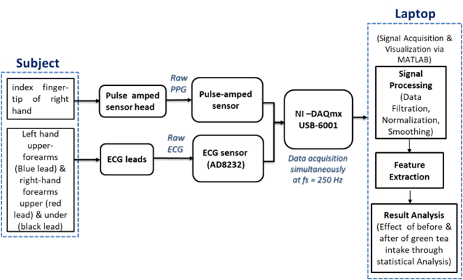

# ECG_PPG_Signal_Processing 
## Overview

This project investigates the physiological effects of an external stimulus (green tea consumption) using Electrocardiogram (ECG) and Photoplethysmography (PPG) signals. The study focuses on signal preprocessing, feature extraction, and cardiovascular parameter analysis before and after stimulus exposure.

## Project Objective

The objective is to analyze changes in cardiovascular characteristics by extracting clinically relevant features from synchronized ECG and PPG signals collected from human subjects.

## Data Acquisition

Data were acquired using ECG and PPG sensors connected through an NI-DAQ USB-6001 data acquisition device.

Measurements were collected:

* Before green tea consumption
* 30 minutes after green tea consumption

Signals were recorded from the finger and forearm for approximately one minute per session.
## Experimental Workflow

## Experimental Setup

Figure: Simultaneous ECG and PPG acquisition using NI-DAQ USB-6001 and physiological sensors.
## Signal Processing Pipeline

* ECG signal preprocessing and filtering
* PPG signal preprocessing and filtering
* Derivative-based PPG analysis
* Peak detection and signal alignment
* Feature extraction and physiological parameter estimation

## Extracted Features

* Pulse Arrival Time (PAT)
* Pulse Wave Velocity (PWV)
* Heart Rate (HR)
* Pulse Transit Time (PTT)

## Tools and Technologies

* MATLAB
* Signal Processing
* Biomedical Signal Analysis
* NI-DAQ USB-6001
* ECG Sensors
* PPG Sensors

## Applications

This work demonstrates the use of non-invasive physiological signals for cardiovascular monitoring and biomedical research.
## Publication
This work was presented at the 2022 IEEE Region 10 Symposium (TENSYMP).
**Citation**
T. Imam et al., "Investigation of Physiological Changes Using ECG and PPG Signal Analysis Following Green Tea Consumption," IEEE TENSYMP 2022.
DOI: [10.1109/TENSYMP54529.2022.9864568](https://doi.org/10.1109/TENSYMP54529.2022.9864568)
